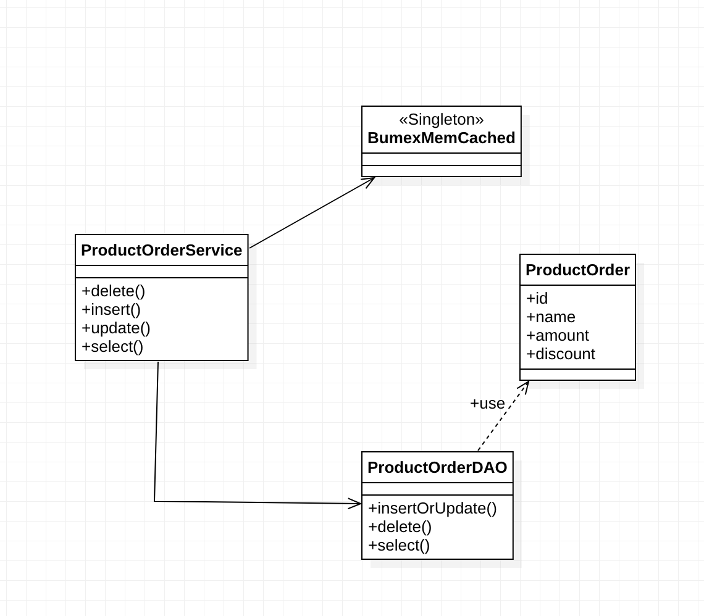

# Getting Started

### Reference Documentation

<h3>1- The given model below </h3>

here 

`The original model has been modified due the use of spring boot. `

<h3>2- Optimizaciones</h3>

   Si tenemos una tabla de pedidos con muchos registros y columnas e incluso blobs:
     
    <h4>A nivel de base de datos: </h4>utilizariamos una base distribuida. 
    En oracle pensariamos en un rac con varias instancias para la base.
    O evaluar utilizar una base de datos no relacional distribuida, utilizando varios nodos.
    En ambos casos, la necesidad de crear indices y evaluar el plan de ejecucion para 
    las queries es necesario.
    <h4>Networking y capa de aplicación:</h4>
    Tener el servicio replicado, podrían utilizarse microinstancias y un load balancer para esto.
    <h4>Otras</h4>
    Mantener una estrategia de cache sobre los datos que no cambian frecuentemente.
    Crear colas y clases que manejen estas colas para procesar las solicitudes. 
    Una vez que llegue una solicitud a la instancia del servicio, 
    por ejemplo guardar un pedido, el pedido se guardara en cache y luego
    ingresara en una cola de "guardar pedidos".
    Un manejador de la cola de la persistencia de los pedidos tendrá luego la responsabilidad de 
    guardar ese pedido cuando el recurso de la base de datos este disponible. 
   

3- La implementacion de ajax se hizo con jquery. Ver el codigo. Tenga en cuenta que si bien 
todas las operaciones se pueden realizar, solo la inserción actualizará la tabla que se muestra en el sitio.
No se implementaron tests.

Se utilizo Spring Boot 2 con una base H2 embebida.

Se puede acceder por url a la base [here](http://localhost:8080/h2-console/login.do?jsessionid=647b98513ae89b08f34086845a5e3784)

    
   
   